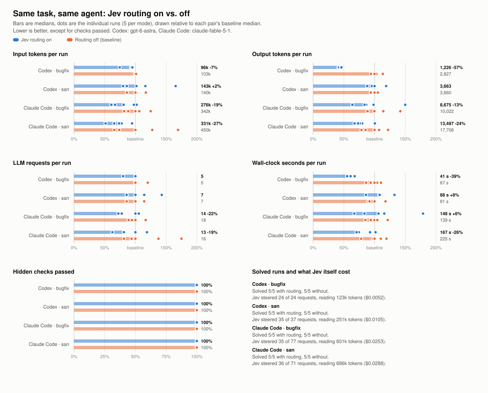

# jev-gateway-bench

Does routing tool choices through Jev make a coding agent cheaper without making it worse?

This is the benchmark for [jev-gateway](https://github.com/vinilana/jev-gateway). It gives a real
coding agent (Codex or Claude Code) the same task twice, once with Jev routing on and once with it
off, meters every token through the gateway, and scores the result with a verifier the agent never
sees.

## Results

Two tasks, two agents, five runs per mode, 40 agent sessions in all (2026-09-18). Codex 0.154 with
`gpt-6-astra` on a ChatGPT subscription, Claude Code 2.1 with `claude-fable-5-1` on a claude.ai
subscription, real Jev (`jev-latest`) with the gateway's default thresholds. Both agents ran clean:
no MCP servers, plugins, skills or personal settings, only their built-in coding tools.

<picture>
  <source media="(prefers-color-scheme: dark)" srcset="charts/comparison-dark.svg">
  
</picture>

Medians of five runs. The percentage is routing on compared with routing off.

| | Codex · bugfix | Codex · san | Claude Code · bugfix | Claude Code · san |
| --- | ---: | ---: | ---: | ---: |
| Runs solved, on / off | 5/5 · 5/5 | 5/5 · 5/5 | 5/5 · 5/5 | 5/5 · 5/5 |
| Input tokens | 96k (-7%) | 143k (+2%) | 276k (-19%) | 331k (-27%) |
| Output tokens | 1,226 (-57%) | 3,663 (0%) | 8,675 (-13%) | 13,497 (-24%) |
| LLM requests | 5 (0%) | 7 (0%) | 14 (-22%) | 13 (-19%) |
| Wall-clock seconds | 41 (-39%) | 88 (+8%) | 148 (+6%) | 167 (-26%) |
| Requests Jev steered | 100% | 95% | 45% | 51% |
| Jev's own cost, 5 runs | $0.005 | $0.011 | $0.025 | $0.029 |

What this says, and what it does not:

- **Nothing broke.** All 40 runs passed every hidden check, with or without routing. No run timed
  out, and no turn was derailed by a forced tool.
- **Codex, debugging:** routing cut output tokens by more than half and wall-clock time by 39%,
  in every one of the five runs. Requests and input tokens barely moved. With Codex the gateway
  forces the tool, so the model skips deliberating about what to do next.
- **Codex, writing a feature:** no effect on tokens, and 8% slower, which is about what the extra
  Jev call per request costs. Routing is not free when there is nothing to save.
- **Claude Code:** the gateway can only hint here (see the gateway's README for why), and Jev was
  confident enough to hint on about half the requests. Runs with routing still used around 20%
  fewer requests and 19 to 27% fewer input tokens on both tasks. Time went both ways: 26% faster on
  one task, 6% slower on the other.
- **Five runs is still a small sample.** The dots in the chart show the spread: on some measures
  the two modes overlap. The Codex debugging result is the only one where every routed run beat
  every baseline run. Everything ran on one machine on one day, with one model per agent.
- Input tokens are mostly cached (80 to 92%), so a saving in input tokens is worth less money than
  the same saving in output tokens.

Raw data is in [results/](results/): `runs.jsonl` and `summary.md` per series, and for every run
the verifier's output, the size of the agent's change, and the gateway's per-request metadata.
Agent transcripts are not published. The two folders with `chess-bugfix` alone are earlier
single-run trials made with a personal set of MCP tools installed; they are kept for the record
and are not comparable with the clean runs above.

Redraw the chart with `npm run chart -- results/2026-09-18-codex results/2026-09-18-claude-fable-5-1`.

## Run it yourself

You need Node.js 22.15 or newer, a [TypeSafe API key](https://docs.typesafe.ai/introduction) in
`~/.jev-gateway/.env` (see the [gateway's quick start](https://github.com/vinilana/jev-gateway#quick-start)),
and Codex and/or Claude Code installed and logged in.

```bash
git clone https://github.com/vinilana/jev-gateway-bench.git
cd jev-gateway-bench
npm install

npm run selftest                                     # prove the tasks measure what they claim (no agent, ~20 s)
npm run bench -- --list                              # tasks and options
npm run bench -- --agent codex --tasks chess-bugfix  # one run with routing on, one with it off
npm run bench -- --agent codex --reps 5 --prices 1.25,0.125,10
npm run bench -- --agent claude --model claude-fable-5-1 --reps 5
```

Agents run clean by default: no MCP servers, plugins, skills or personal settings. Add
`--user-tools` to measure your own setup instead. It changes the picture a lot: one setup here sent
285 tools and about 200,000 tokens with every Claude Code request, against 6 tools and 7,000 tokens
clean.

**Real agents spend real quota.** Every run is a full agent session. Start with one task and
`--reps 1`, look at the numbers, and scale up from there.

## How a run works

1. A fresh workspace is created in a temp directory from the task's starting files and committed to
   a git repository of its own.
2. A fresh gateway is started just for this run, on its own port (`--port`, default 8890), with
   routing on or off. Gateways you use every day are not touched, and nothing another session does
   can leak into the numbers.
3. The agent is started unattended inside the workspace, pointed at that gateway exactly the way
   `jev-codex` and `jev-claude` do it, with edits and test runs allowed. It gets the task prompt
   and a time limit.
4. The gateway's own metering gives the totals for the run: LLM requests, input tokens (and how
   many were cached), output tokens (and how many were reasoning), Jev calls and tokens, and how
   each request was handled.
5. A hidden verifier scores the workspace.

Modes alternate within a repetition and swap order between repetitions, so neither one always goes
first.

Results land in `results/<timestamp>/`: `runs.jsonl` (one line per run), `summary.md`, and per run
the agent's output, the gateway log, the verifier's output and a diff summary. Rebuild a summary
any time with `npm run report -- <dir> [--prices in,cached,out]`.

## Reading the summary

- **Solved** means every hidden check passed. A cheaper run that is not solved is not a saving.
- **Cost per solved task** divides everything spent, failed runs included, by the runs that were
  solved. It needs `--prices` (USD per million input, cached input and output tokens for your
  model) and adds Jev's own cost. This is the number to decide on.
- **Requests Jev steered** is the share of LLM requests that were not plain passthrough. If it is
  low, routing had little chance to matter: the gateway's dashboard explains why.
- **Failed LLM requests** and **agent timeouts** catch the expensive failure: a wrongly forced tool
  can derail a turn, and one derailment can cost more than many routed turns save.
- With fewer than five runs per mode the summary says so.

## The chess tasks

All three are about one chess rules engine with a small, exact API
([SPEC.md](tasks/chess/SPEC.md)). Chess was chosen because it has an unusually objective
yardstick: **perft**, the number of move sequences of a given length from a position. The counts
are published, and one wrong rule anywhere (en passant, castling, pins, promotion) changes them.
The verifier runs perft through the public API on six standard positions, plus targeted checks for
FEN handling, draws and game endings.

| Task | The agent has to | Kind of work |
| --- | --- | --- |
| `chess-engine` | Build the whole engine from the spec | Long generation, many test runs |
| `chess-bugfix` | Find and fix five injected bugs, with failing perft tests as the only clue | Exploration and debugging |
| `chess-san` | Add algebraic notation (`san`, `moveSan`, `history`) to a working engine | A focused feature |

They differ on purpose. Routing may pay off on the mechanical middle turns of one kind of task and
not on another, and an average over one kind of work would hide that.

`tasks/chess/reference/chess.js` is a complete solution. It never reaches a workspace: it exists to
prove the verifier right, and the bugfix and SAN tasks are generated from it. `npm run selftest`
checks that the reference passes every check, that no starting workspace already passes, and that
each injected bug is caught on its own.

One caveat: this repository is public, so an agent with web access could in principle find the
reference. The agents work in a temp directory, are never told it exists, and the tasks give them
no reason to go looking.

## Could the agents have cheated?

A benchmark of agents has an obvious hole: an agent that finds an earlier run's workspace, a
scratch file, or this repository's reference solution is not solving the task. Agents run on the
same machine as the benchmark, Codex's sandbox can read the whole disk, and Claude Code is allowed
`cat` and `ls`, so nothing stops them from looking. What the benchmark does about it:

- **Every run gets a private directory** holding its workspace and its own temp directory
  (`TMPDIR`), which is deleted when the run ends, also when the benchmark is interrupted. Anything a
  dead benchmark left behind is removed before the next one starts.
- **Every run is audited.** Each agent keeps a record of the commands and tool calls it made. The
  runner reads it back and stores, in `runs.jsonl` under `isolation`, every path outside the run's
  directory and whether the run created it or found it. A run that read something it did not create
  is flagged on the console.
- Agents run without web tools or network by default, so the public copy of the reference is out of
  reach.
- **The agents' own harnesses are told to keep nothing.** Codex runs with `--ephemeral` and Claude
  Code with `--no-session-persistence`, so no session is saved that a later run could resume or be
  reminded of, and neither loads personal settings, plugins or skills. The audit reads the agent's
  output instead of files in its home directory.

One gap remains: an agent told to use a private temp directory may still write `/tmp/check.mjs` by
name, as Claude Code likes to. The audit records it, and a later run that read such a file without
creating it would be flagged as having found it.

The 40 published runs were made before this existed and were audited afterwards from the same
records, 385 Claude Code tool calls and 120 Codex commands:

- No run opened the reference solution, another run's workspace, or a file another run had left.
- Nine Claude Code runs wrote test scripts of their own into the shared `/tmp`, such as
  `/tmp/check.mjs`. Each run created its copy before using it, so nothing was carried over, but it
  is the channel the private temp directory now closes.
- Seven Codex runs looked for an `AGENTS.md` next to their workspace (there was none), and one
  searched the home directory for files of that name. That is Codex looking for instructions, not
  for answers, and that run was the slowest of its group, not the fastest.
- Neither harness carried anything over. Codex's `memories` feature was off and its store empty.
  Claude Code keeps memory and transcripts per working directory, every run had a directory of its
  own, and the 24 memory folders it created for them are all empty. Both saved session transcripts,
  which nothing reads unless a session is resumed, and no run resumed one.

What no audit can rule out is what the models already know: chess rules, perft numbers and
algebraic notation are all over their training data. That lifts both columns equally. It is a
reason not to read these tasks as a measure of how good the agents are, only of what routing
changes.

## Testing the benchmark without an agent

`--agent fake` replaces the agent with a script that sends a few requests through the gateway and
then writes the reference solution. Together with the fake provider and the gateway's mock Jev, the
whole pipeline runs in seconds and costs nothing:

```bash
node dev/fake-upstream.mjs &
MOCK_JEV_SCRIPT=exec_command node node_modules/jev-gateway/scripts/mock-jev.mjs &
TYPESAFE_API_KEY=mock TYPESAFE_BASE_URL=http://127.0.0.1:8799 npm run bench -- --agent fake --reps 2
```

## Adding a task

A task is an object with an `id`, a `title`, a `prompt`, a `timeoutMinutes`, a `setup(workspace)`
that writes the starting files, and a `verify(workspace)` that returns the command line of a
verifier. The verifier prints `{"total": n}` and then one `{"name", "ok"}` JSON line per check, as
it goes, so a solution that hangs keeps the credit it earned before the timeout. Add the task to
`TASKS` in `run.mjs`.

## License

MIT
